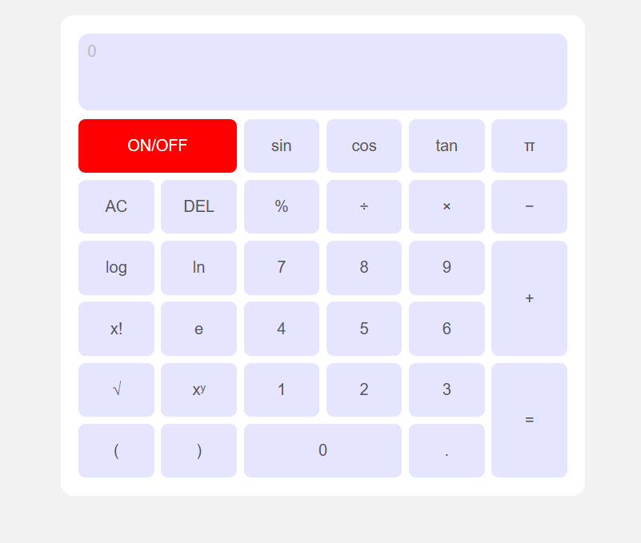
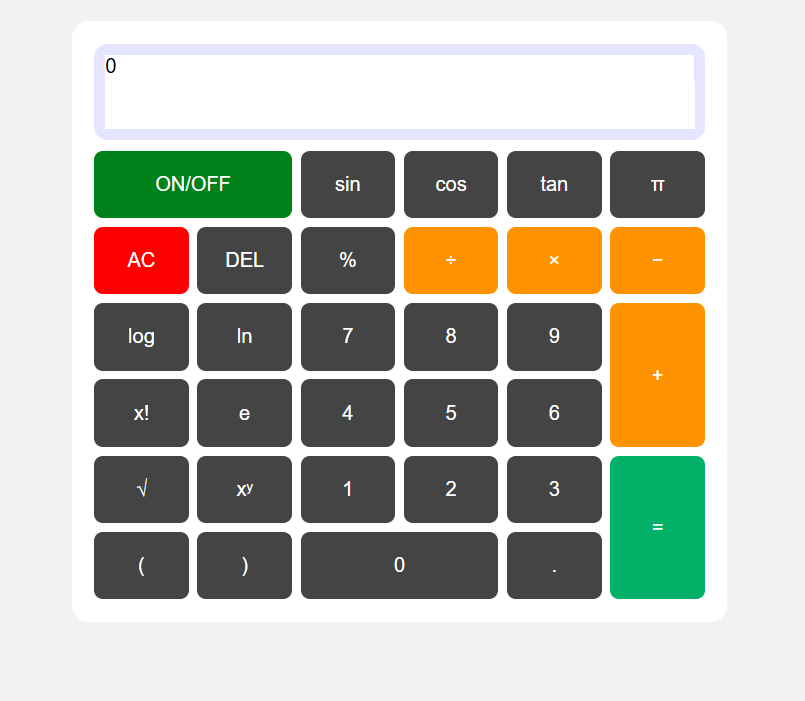
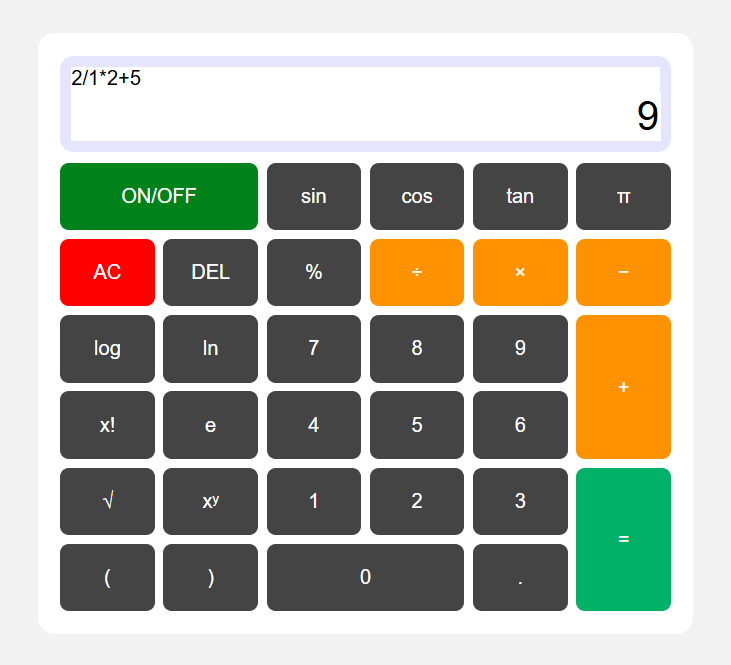

# Calculator

A simple web-based scientific calculator.

## Features

- ON/OFF power toggle button
- Scientific functions:
  - `sin()`, `cos()`, `tan()`
  - `log()`, `ln()`
  - Square root (`√`)
  - Power (`xʸ`)
  - Factorial (`x!`)
- Constants:
  - Pi (`π`)
  - Euler's number (`e`)
- Basic arithmetic operations:
  - Addition (`+`), Subtraction (`−`), Multiplication (`×`), Division (`÷`)
  - Modulus (`%`)
- Parentheses support: `(` and `)`
- Clear (`AC`) and delete last input (`DEL`)
- Decimal point (`.`)
- Large zero button (`0`)
- Responsive and intuitive button layout including wide and tall buttons
- Real-time calculation with equal button (`=`)

## Demo Screenshot
# OFF

# ON

# Working

